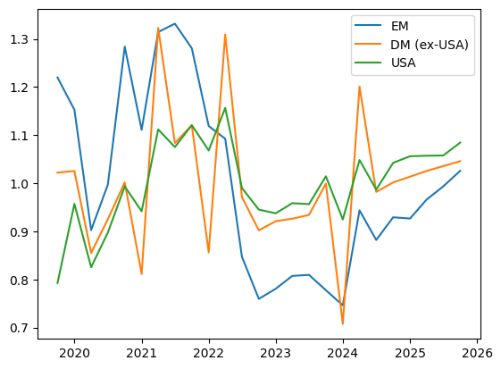
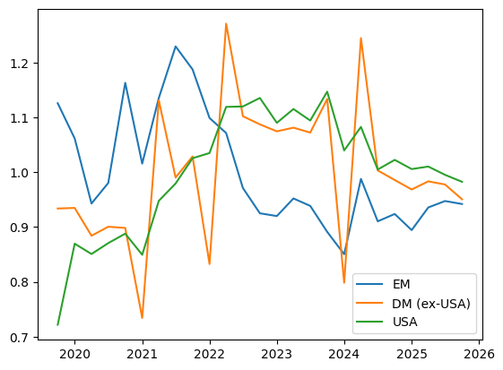

# heterogeneity_code {.unnumbered}

__________
# Where we at?

2026-01-29

- Can the variation in important asset classes prices be explained by the variation in funds holdings principal components? How?

## International Bond Holdings Evolution

 

**1. Evolution of Bond Dollar Holdings Across Time**  
  
For each economy type, the figure shows the ratio of bond dollar holdings in that economy type and period, as proportion to the time average bond dollar holdings for the economy type (for comparison across economies).

 

**2 Evolution of the Portfolio Allocation to Each Economy Across Time (size weighted)**  
  
For each economy type, the figure shows the fund size-weighted ratio of the portfolio share assigned to that economy type (holdings in economy type / total holdings) in a period, as proportion to the time average portfolio share for the economy type (for comparison across economies).

 

**2 Evolution of the Portfolio Allocation to Each Economy Across Time (equally weighted)**  
  
For each economy type, the figure shows the equally sized ratio of the portfolio share assigned to that economy type (holdings in economy type / total holdings) in a period, as proportion to the time average portfolio share for the economy type (for comparison across economies).

 

**Main Message:** We need to see bond aggregate prices and see how these might be driving those responses by these guys. Currently in script [EM_vs_DMexUSA.py](src/heterogeneity_code/a_nport_portshares/c_PCs_prelim_regressions/check_lhs/EM_vs_DMexUSA.py)