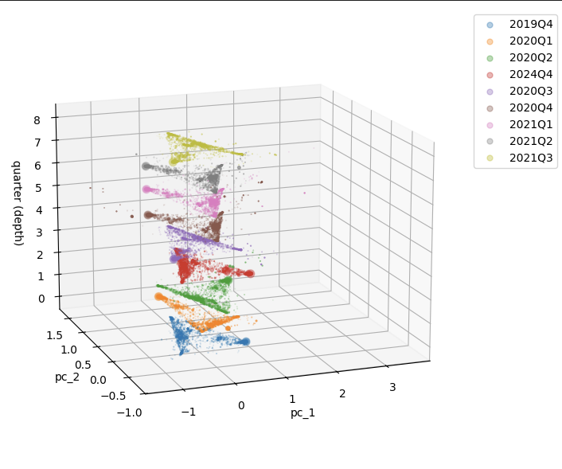

# heterogeneity_code {.unnumbered}

__________
# Where we at?

2026-01-29

- Can the variation in important asset classes prices be explained by the variation in funds holdings principal components? How?

Cross-sectional geometries of the first PCs using simple asset categories (sov debt, corp debt, loans, others)